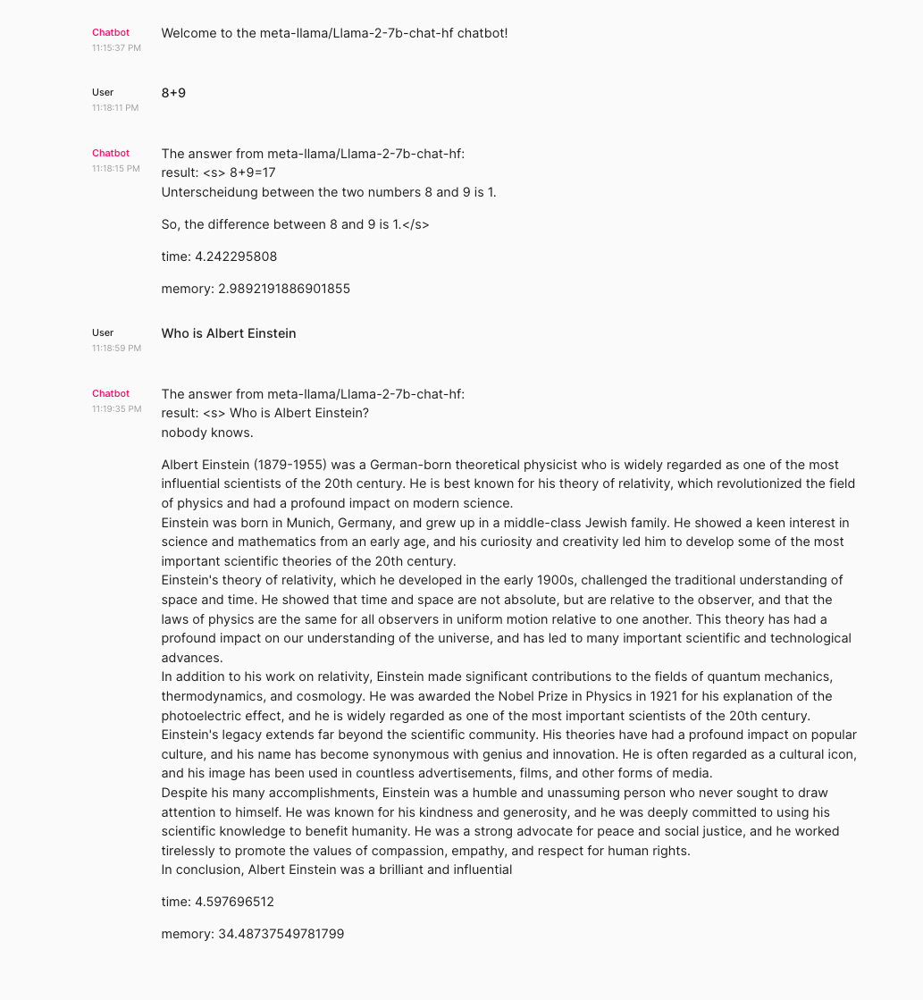

# 🖇️ Combining Systems: Chainlit App with Langchain and FastAPI Deployment

We'll be combining the two systems listed below into a single `docker-compose.yaml` file!

# Build 🏗️
There are two tasks for today:

- Add the Chainlit app to our `docker compose`
- Point your Chainlit app at the Llama2 FastAPI service

# Ship 🚢
A public IP address pointing to your application.

# Share 🚀
Make a social media post about your final application and tag @AIMakerspace

# Steps
1. Launch an ec2 instance with the configuration below
- g4dn.xlarge 4cpu 16G RAM
- ubuntu
- 50GB storage room

2. Install docker and Nvidia-driver
3. Clone this repo and navigate to `Week\ 3/Tuesday/fastapi`, run `cp .env.sample .env` and fill in your HUGGINGFACE_TOKEN
4. Run `docker compose up` in the `Week\ 3/Tuesday/fastapi` folder.
5. In your browser, enter the public ip of your ec2 instance

